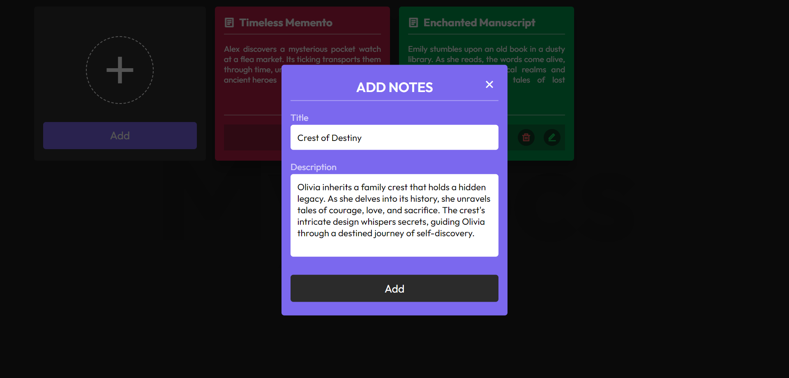

# Notes App

Welcome to the Notes App repository! This project is a JavaScript-based web application designed to help users manage their notes effectively. Built with HTML, CSS, and JavaScript, it features a modern UI design for an intuitive and user-friendly experience. The app allows users to add, edit, and delete notes, and it stores them in the local storage for convenience.

## Preview

### 1. Adding Task


### 2. Edit Task



### 4. Organized Notes


## Features

- **Add Notes:** Easily add new notes with a modern and intuitive interface.
- **Edit Notes:** Edit existing notes to keep information up-to-date.
- **Delete Notes:** Remove unwanted notes effortlessly.
- **Local Storage:** Store notes in the local storage for persistence across sessions.
- **Modern UI Design:** Sleek layout and visually appealing design for an enjoyable user interface.

## Getting Started

To run the Notes App locally, follow these steps:

1. Clone the repository to your local machine:

   ```bash
   git clone https://github.com/Devsethi3/Notes-App.git
   ```

2. Open the `index.html` file in your preferred web browser.

## Usage

1. Click the "Add Task" button to create a new note.
2. Edit a note by clicking the edit icon.
3. Delete a note by clicking the delete icon.
4. View organized notes in a user-friendly manner.

## Customization

Feel free to customize this project to fit your preferences. Update styles, colors, and layout in the HTML and CSS files. You can also extend the functionality to include additional features or customization options.

## Contributing

If you'd like to contribute to this project, please follow these steps:

1. Fork the repository.
2. Create a new branch for your feature or improvement.
3. Make your changes and commit them with descriptive messages.
4. Push your changes to your forked repository.
5. Open a pull request to merge your changes into the main branch.

Explore the Notes App, stay organized, and consider contributing to its development. Thank you for checking out the repository!